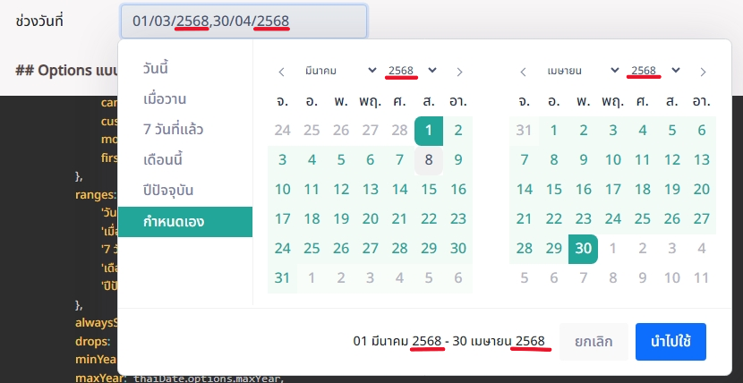

# Date-Range-Picker-Thai
    DateRangePicker  ปฏิทินแบบไทยๆ ที่มีการปรับแต่งค่าที่คิดว่าเหมาะสมกับการใช้งาน วัน/เดือน/ปี และวิธีการตั้งค่าใช้งานปฏิทิน

## ติดตั้ง Library
```
<link rel="stylesheet" href="src/dateRangePicker/daterangepicker.css">
<script type="text/javascript" src="https://cdn.jsdelivr.net/jquery/latest/jquery.min.js"></script>
<script type="text/javascript" src="https://cdnjs.cloudflare.com/ajax/libs/moment.js/2.30.1/moment.min.js"></script>
<script type="text/javascript" src="https://cdnjs.cloudflare.com/ajax/libs/moment.js/2.30.1/locale/th.min.js"></script>
<script type="text/javascript" src="src/dateRangePicker/daterangepicker-custom.js"></script>
<script type="text/javascript" src="src/dateRangePicker/daterangepicker-config.js"></script>
```

## ปรับแก้อะไรใน Library (Date Range Picker)
1. เพิ่ม options เปิดใช้งานปีพุทธศักราช ***buddhistYear*** ค่าเริ่มต้นเป็น **true**


2. ปรับ CSS ให้มีเรียกใช้ชุดสีผ่าน var() ที่มีการตั้งค่า theme


## ตัวอย่างการนำไปใช้
https://tichavich.github.io/Date-Range-Picker-Thai/

## References
1. [GitHub daterangepicker](https://github.com/dangrossman/daterangepicker)
2. [daterangepicker](https://www.daterangepicker.com/)


## License
MIT License
